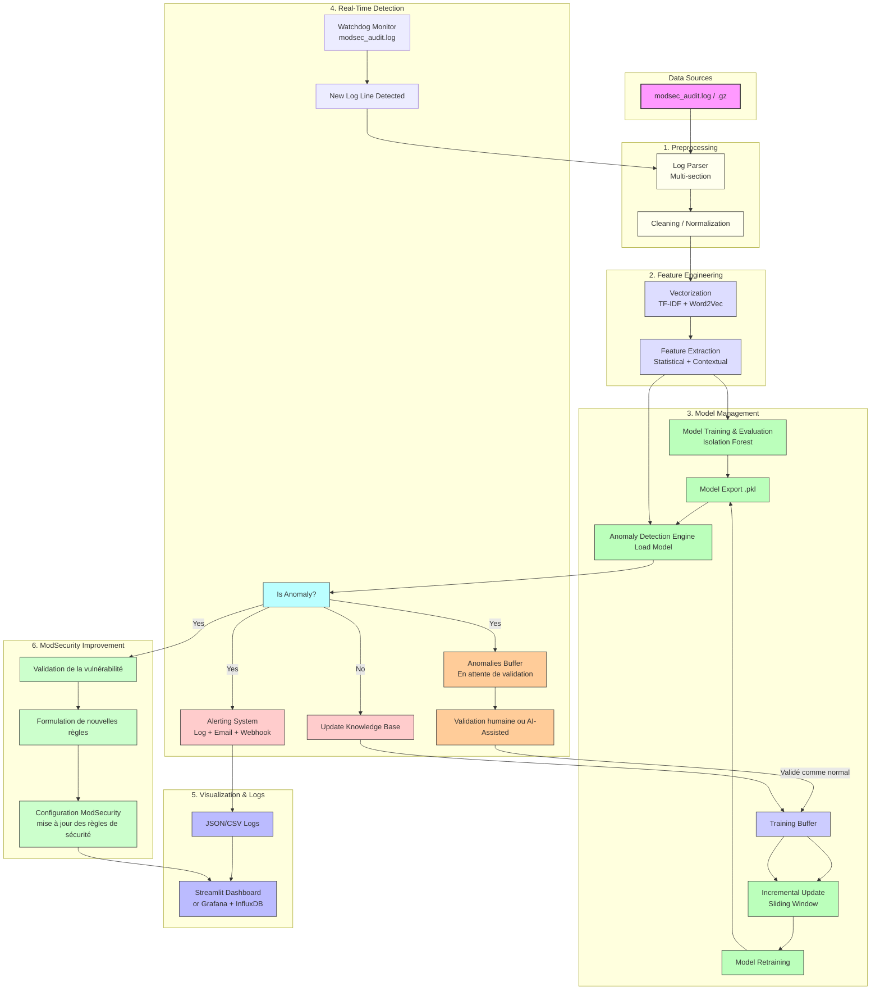
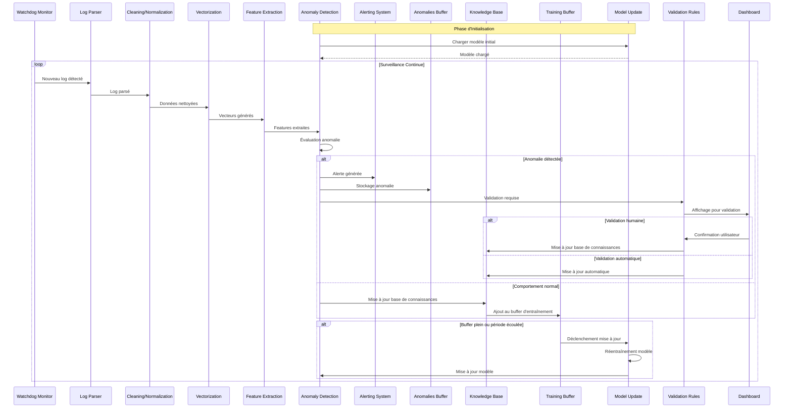
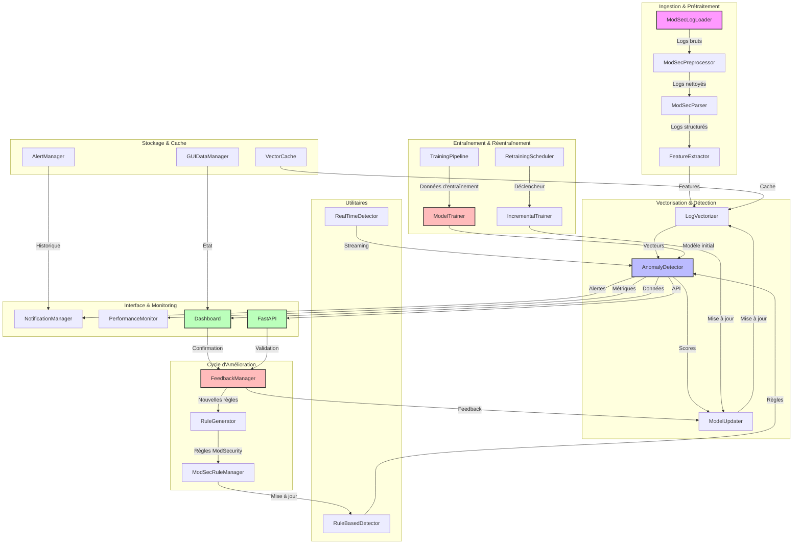
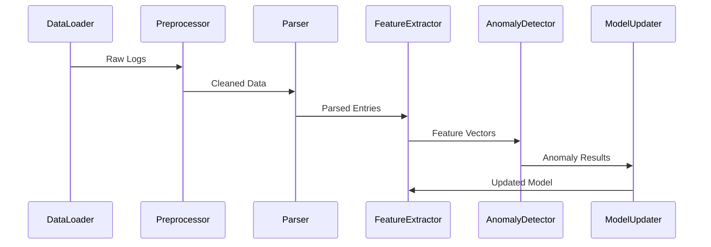

# 🛡️ ModSec AI - Détection d'Anomalies en Temps Réel pour ModSecurity

[](https://www.python.org/downloads/)
[](LICENSE)
[](docs/)
[](tests/)

ModSec AI est une solution avancée de détection d'anomalies en temps réel pour les logs ModSecurity, combinant l'intelligence artificielle et l'analyse comportementale pour renforcer la sécurité de vos applications web.

## 🎯 Introduction


### Contexte
Les logs ModSecurity génèrent un volume important de données de sécurité qui nécessitent une analyse continue. Les approches traditionnelles basées sur des règles statiques ne suffisent plus face à l'évolution constante des menaces.

### Objectifs
- Détection en temps réel des comportements anormaux dans les logs ModSecurity
- Apprentissage continu pour s'adapter aux nouveaux patterns légitimes
- Réduction des faux positifs grâce à l'analyse comportementale
- Amélioration continue de la détection via le réentraînement du modèle

### Importance
ModSec AI s'inscrit dans une approche moderne de la sécurité (DevSecOps) en :
- Automatisant l'analyse des logs de sécurité
- Fournissant des insights en temps réel
- Permettant une réponse proactive aux menaces
- S'intégrant dans les pipelines CI/CD

## 🧠 Fonctionnalités Principales

### 🔍 Détection en Temps Réel
- Analyse continue des logs ModSecurity
- Détection immédiate des comportements anormaux
- Alertes configurables (email, Slack, webhook)

### 📊 Analyse Comportementale
- Apprentissage des patterns légitimes
- Détection des déviations comportementales
- Réduction des faux positifs

### 🔄 Apprentissage Continu
- Mise à jour automatique du modèle
- Adaptation aux nouveaux patterns
- Amélioration continue de la détection

### 📈 Visualisation & Reporting
- Dashboard interactif (Streamlit)
- Rapports détaillés des anomalies
- Métriques de performance

## 🏗️ Architecture Technique



### Flux de Séquence Complet



### Description des Composants

#### 1. Preprocessing
- **Log Parser** : Analyse multi-section des logs ModSecurity
- **Cleaning/Normalization** : Nettoyage et standardisation des données

#### 2. Feature Engineering
- **Vectorization** : Transformation en vecteurs (TF-IDF + Word2Vec)
- **Feature Extraction** : Extraction de caractéristiques statistiques et contextuelles

#### 3. Model Management
- **Model Training** : Entraînement et évaluation du modèle Isolation Forest
- **Model Export** : Sauvegarde du modèle entraîné
- **Incremental Update** : Mise à jour incrémentale avec fenêtre glissante
- **Model Retraining** : Réentraînement périodique du modèle

#### 4. Real-Time Detection
- **Watchdog Monitor** : Surveillance en temps réel des logs
- **Anomaly Detection** : Détection des anomalies
- **Alerting System** : Système d'alertes multi-canal
- **Validation** : Processus de validation humaine ou assistée par IA

#### 5. Visualization & Logs
- **JSON/CSV Logs** : Stockage structuré des logs
- **Training Buffer** : Buffer d'apprentissage
- **Dashboard** : Interface de visualisation (Streamlit/Grafana)

#### 6. ModSecurity Improvement
- **Validation** : Validation des vulnérabilités détectées
- **Rule Formulation** : Création de nouvelles règles
- **Configuration** : Mise à jour des règles ModSecurity

## 🏗️ Architecture Technique Complète



### Composants Détaillés

#### Ingestion & Prétraitement
- **ModSecLogLoader** : Chargement et validation des logs ModSecurity
- **ModSecPreprocessor** : Nettoyage et normalisation des données
- **ModSecParser** : Extraction structurée des informations
- **FeatureExtractor** : Extraction des caractéristiques pertinentes

#### Vectorisation & Détection
- **LogVectorizer** : Transformation en vecteurs (Word2Vec/TF-IDF)
- **AnomalyDetector** : Détection des anomalies (Isolation Forest, LOF, etc.)
- **ModelUpdater** : Mise à jour incrémentale du modèle

#### Interface & Monitoring
- **NotificationManager** : Gestion des alertes (email, Slack, webhook)
- **PerformanceMonitor** : Suivi des métriques de performance
- **Dashboard** : Interface utilisateur Streamlit
- **FastAPI** : API REST pour l'intégration

#### Stockage & Cache
- **VectorCache** : Cache des vecteurs pour optimisation
- **AlertManager** : Gestion de l'historique des alertes
- **GUIDataManager** : Gestion de l'état de l'interface

#### Utilitaires
- **RuleBasedDetector** : Détection basée sur des règles
- **RealTimeDetector** : Détection en temps réel

#### Cycle d'Amélioration
- **FeedbackManager** : Gestion des retours utilisateur
- **RuleGenerator** : Génération de nouvelles règles
- **ModSecRuleManager** : Gestion des règles ModSecurity

#### Entraînement & Réentraînement
- **TrainingPipeline** : Pipeline d'entraînement initial
- **ModelTrainer** : Entraînement du modèle
- **RetrainingScheduler** : Planification du réentraînement
- **IncrementalTrainer** : Entraînement incrémental

## 📊 Flux de Données global



## 📁 Structure du Projet

```
modsec_ai/
├── config/             # Configuration files
├── docs/              # Documentation
├── scripts/           # Utility scripts
├── src/               # Source code
│   ├── api/          # API endpoints
│   ├── core/         # Core functionality
│   ├── models/       # ML models
│   └── utils/        # Utilities
├── tests/            # Test suite
├── .pylintrc         # Pylint configuration
├── mypy.ini          # Mypy configuration
├── requirements.txt  # Dependencies
└── setup.py         # Package setup
```

## 🧩 Modules & Composants

### 📦 DataLoader
- Rôle : Chargement et validation des logs ModSecurity
- Documentation : [docs/dataloader.md](docs/dataloader.md)

### 🔧 Preprocessor
- Rôle : Nettoyage et normalisation des données
- Documentation : [docs/preprocessor.md](docs/preprocessor.md)

### 📝 Parser
- Rôle : Extraction structurée des informations des logs
- Documentation : [docs/parser.md](docs/parser.md)

### 🎯 FeatureExtractor
- Rôle : Transformation des données en vecteurs exploitables
- Documentation : [docs/feature_extractor.md](docs/feature_extractor.md)

### 🧠 AnomalyDetector
- Rôle : Détection des comportements anormaux
- Documentation : [docs/anomaly_detector.md](docs/anomaly_detector.md)

### 🔄 ModelUpdater
- Rôle : Mise à jour continue du modèle
- Documentation : [docs/model_updater.md](docs/model_updater.md)

### 👀 WatchdogMonitor
- Rôle : Surveillance continue des fichiers de logs ModSecurity
- Documentation : [docs/watchdog_monitor.md](docs/watchdog_monitor.md)

### 🧹 CleaningNormalization
- Rôle : Nettoyage et standardisation des données
- Documentation : [docs/cleaning_normalization.md](docs/cleaning_normalization.md)

### 📊 Vectorization
- Rôle : Transformation des logs en vecteurs
- Documentation : [docs/vectorization.md](docs/vectorization.md)

### 🔔 AlertingSystem
- Rôle : Gestion des alertes et notifications
- Documentation : [docs/alerting_system.md](docs/alerting_system.md)

### 📥 AnomaliesBuffer
- Rôle : Stockage temporaire des anomalies
- Documentation : [docs/anomalies_buffer.md](docs/anomalies_buffer.md)

### 🧠 KnowledgeBase
- Rôle : Base de connaissances des patterns
- Documentation : [docs/knowledge_base.md](docs/knowledge_base.md)

### 📚 TrainingBuffer
- Rôle : Buffer d'entraînement du modèle
- Documentation : [docs/training_buffer.md](docs/training_buffer.md)

### ✅ ValidationRules
- Rôle : Gestion des règles de validation
- Documentation : [docs/validation_rules.md](docs/validation_rules.md)

### 📊 Dashboard
- Rôle : Interface utilisateur pour la visualisation et la validation
- Documentation : [docs/dashboard.md](docs/dashboard.md)

## ⚙️ Installation

### Prérequis
- Python 3.8+
- pip
- virtualenv (recommandé)

### Installation

1. Cloner le repository :
```bash
git clone https://github.com/yourusername/modsec_ai.git
cd modsec_ai
```

2. Créer et activer l'environnement virtuel :
```bash
python -m venv venv
source venv/bin/activate  # Linux/Mac
.\venv\Scripts\activate   # Windows
```

3. Installer les dépendances :
```bash
pip install -r requirements.txt
```

4. Configuration :
```bash
cp config/config.example.yaml config/config.yaml
# Éditer config.yaml avec vos paramètres
```

## 🚀 Guide de Démarrage Rapide

1. Lancer le pipeline de détection :
```bash
python -m modsec_ai.src.core.pipeline
```

2. Démarrer le dashboard :
```bash
streamlit run modsec_ai/src/api/dashboard.py
```

3. Accéder à l'API :
```bash
uvicorn modsec_ai.src.api.main:app --reload
```

## 📚 Documentation

La documentation complète est disponible dans le dossier `docs/` :
- [Guide d'installation](docs/installation.md)
- [Guide d'utilisation](docs/usage.md)
- [Architecture](docs/architecture.md)
- [API Reference](docs/api.md)
- [Configuration](docs/configuration.md)

## 🙋 Contribuer

1. Fork le projet
2. Créer une branche (`git checkout -b feature/AmazingFeature`)
3. Commit les changements (`git commit -m 'Add AmazingFeature'`)
4. Push vers la branche (`git push origin feature/AmazingFeature`)
5. Ouvrir une Pull Request

### Contact
- Email : onyagamarcel2@gmail.com
- Issues : [GitHub Issues](https://github.com/onyagamarcel2/modsec_ai/issues)

## ⚖️ Licence

Ce projet est sous licence MIT. Voir le fichier [LICENSE](LICENSE) pour plus de détails.

## 🏷️ Crédits


- [Drain3](https://github.com/IBM/Drain3) - Base du parser de logs
- [Scikit-learn](https://scikit-learn.org/) - Algorithmes de détection d'anomalies


---

<div align="center">
  <sub>Built with ❤️ by Marcel ONYAGA</sub>
</div> 