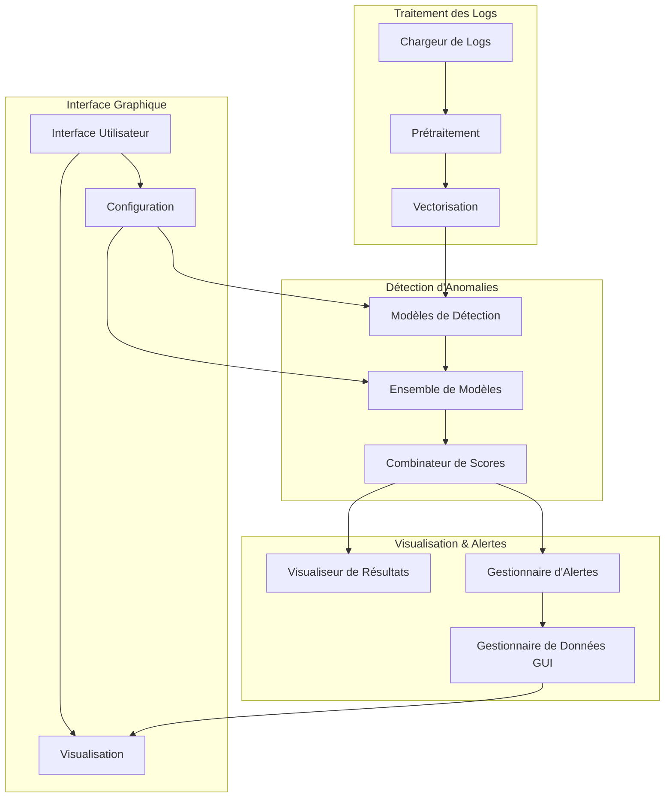

# ModSec-AI : Détection d'Anomalies pour ModSecurity

## Architecture du Système



## Structure du Projet

```
modsec_ai/
├── src/
│   ├── config/
│   │   └── model_config.py      # Configuration des modèles
│   ├── data/
│   │   ├── log_loader.py       # Chargement des logs
│   │   └── preprocessor.py     # Prétraitement des données
│   ├── models/
│   │   ├── anomaly_detectors.py # Algorithmes de détection
│   │   ├── vectorizer.py       # Vectorisation des logs
│   │   └── score_combiner.py   # Combinaison des scores
│   ├── utils/
│   │   ├── alert_manager.py    # Gestion des alertes
│   │   └── gui_data_manager.py # Données pour l'interface
│   └── visualization/
│       └── result_visualizer.py # Visualisation des résultats
├── scripts/
│   ├── train_model.py          # Entraînement des modèles
│   └── detect_anomalies.py     # Détection en temps réel
└── docs/
    ├── training.md             # Guide d'entraînement
    ├── detection.md            # Guide de détection
    └── visualization.md        # Guide de visualisation
```

## Installation

1. Cloner le dépôt :
```bash
git clone https://github.com/votre-repo/modsec-ai.git
cd modsec-ai
```

2. Créer un environnement virtuel :
```bash
python -m venv venv
source venv/bin/activate  # Linux/Mac
venv\Scripts\activate     # Windows
```

3. Installer les dépendances :
```bash
pip install -r requirements.txt
```

## Utilisation Rapide

### Entraînement d'un Modèle

```bash
python scripts/train_model.py \
    --log-file /chemin/vers/logs/modsec.log \
    --output-dir models \
    --detector-type ensemble \
    --vectorizer-type word2vec \
    --cross-validate
```

### Détection d'Anomalies

```bash
python scripts/detect_anomalies.py \
    --log-file /chemin/vers/logs/modsec.log \
    --model-dir models \
    --output-dir anomalies \
    --threshold 0.5 \
    --batch-size 10
```

## Documentation Détaillée

- [Guide d'Entraînement](docs/training.md)
- [Guide de Détection](docs/detection.md)
- [Guide de Visualisation](docs/visualization.md)

## Fonctionnalités Principales

1. **Détection d'Anomalies Multi-Modèles**
   - Isolation Forest
   - Local Outlier Factor
   - Elliptic Envelope
   - One-Class SVM
   - Ensemble de modèles

2. **Combinaison de Scores**
   - Moyenne
   - Maximum
   - Minimum
   - Moyenne pondérée

3. **Visualisation**
   - Courbes d'entraînement
   - Matrices de confusion
   - Distributions des scores
   - Courbes ROC
   - Comparaison des modèles

4. **Interface Graphique**
   - Sélection des modèles
   - Configuration des paramètres
   - Visualisation en temps réel
   - Gestion des alertes

## Contribution

Les contributions sont les bienvenues ! Consultez [CONTRIBUTING.md](CONTRIBUTING.md) pour les directives.

## Licence

Ce projet est sous licence MIT. Voir [LICENSE](LICENSE) pour plus de détails. 